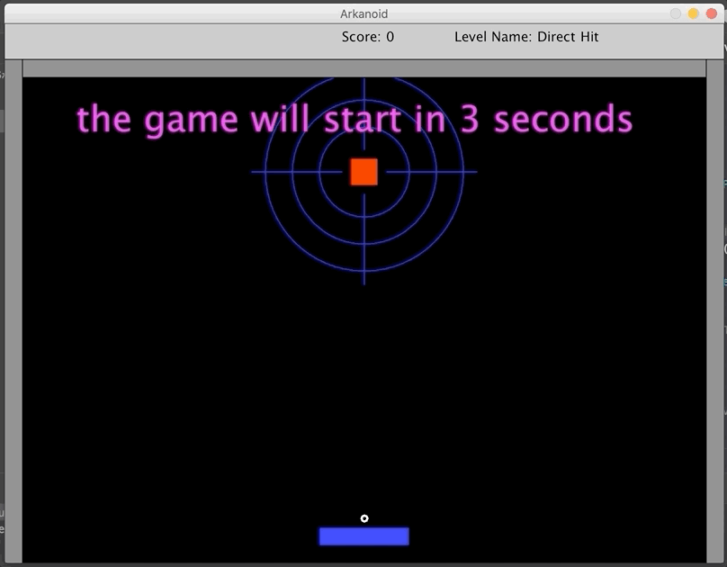

# ArkanoidGame

## Introduction

Intro to OOP course java project - Arkanoid game.

The game contains stages with increasing difficulty levels, varied backgrounds.
The game is implemented in Java using OOP principles:

- Use of polymorphism and inheritance.
- Familiarity with basic design patterns in OOP such as decorator, observer and factory.
- Using java collections and data structures.
- Creating game levels with different difficulties.
- keep open/closed principle states.
- Working with GUI.

## Simulation



## Installation
1. Clone the repository:
```
$ git clone https://github.com/SapirDavid/ArkanoidGame.git

```

2. run this commands:
```
$ make
$ make jar
$ make run
```
